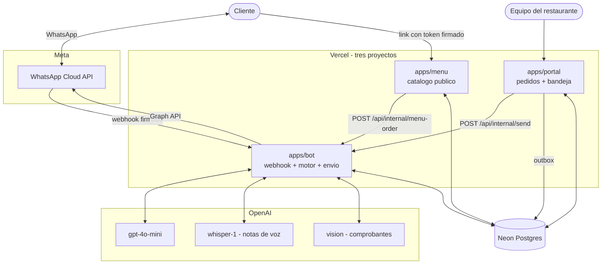
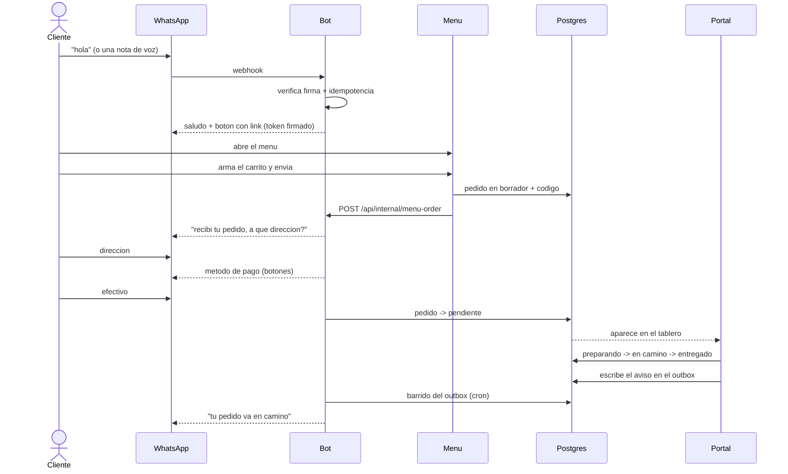
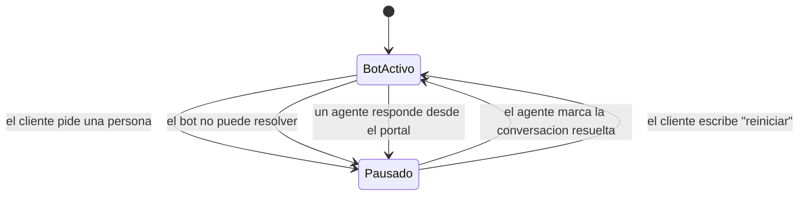

# ARCHITECTURE — Sistema de pedidos por WhatsApp

> Dónde encaja cada pieza. Documento vivo.

## Principios

- **Un solo camino de salida.** Todo mensaje que le llega al cliente sale por
  `apps/bot`. El portal y el menú le piden a él que envíe; no construyen un
  segundo camino.
- **El flujo del pedido es código, no modelo** (ADR-09).
- **El dominio vive en `packages/shared`.** Tres copias del mismo tipo se
  desincronizan sin que nadie lo note.
- **Degradación con gracia.** Si el modelo falla, el bot responde con un texto
  fijo. Si Meta falla, el aviso se reintenta. Nunca silencio.

## Contexto

> El portal **nunca** llama a Meta. Para responderle a un cliente le pide al
> bot que envíe; para avisar un cambio de estado escribe en el outbox. Las dos
> rutas existen por el mismo motivo: que Meta esté caída o la ventana de 24 h
> cerrada no puede bloquear el trabajo del restaurante.

> El número de WhatsApp de este diagrama es **compartido** con Qanelo, por
> rotación manual (ADR-11) — no es un número propio de este proyecto ni se
> configura desde acá. `BOT_ACTIVE` decide si el candado de salida
> (`services/whatsapp/client.ts`) deja pasar algo o no.

## El flujo de un pedido

## El control del asistente

**Abrir una conversación no pausa el bot; responder sí.** Abrir un chat es
mirar, escribir es tomarlo. Usar la apertura como señal silenciaría el bot por
accidente cada vez que alguien hace clic.

## Dónde vive cada cosa

### `packages/shared`

| Pieza | Archivo | Responsabilidad única |
|---|---|---|
| Esquema | `db/schema.ts` | Las 12 tablas |
| Conexión | `db/client.ts` | Neon en producción, `pg` en local |
| Token del menú | `domain/menu-token.ts` | Firmar y verificar de quién es el link |
| Ventana de 24 h | `domain/session-window.ts` | Si se puede enviar o no |
| Código de pedido | `domain/order-code.ts` | Generar y reconocer `#PEDIDO` |
| Catálogo | `domain/catalog.ts` | Tipos y búsqueda (helpers puros) |
| Negocio | `config/business-info.ts` | Horario, domicilio, pagos |

### `apps/bot`

| Pieza | Archivo | Responsabilidad única |
|---|---|---|
| Firma y verificación | `services/whatsapp/verify.ts` | Que el webhook venga de Meta |
| Envío | `services/whatsapp/client.ts` | **El único** camino de salida |
| Multimedia | `services/whatsapp/media.ts` | Descargar audio e imágenes |
| Modelo | `services/openai/*.ts` | Conversación, transcripción, visión |
| Orquestador | `bot/orchestrator.ts` | Qué puerta atiende cada mensaje |
| Intención | `bot/intent.ts` | Lo que se reconoce sin modelo |
| Mensajes | `bot/messages.ts` | Todo el texto que lee el cliente |
| Motor | `bot/engine.ts` | Dirección, pago, cierre |
| Asesor | `bot/advisor.ts` | Preguntas libres y escalamiento |
| Candado | `bot/order-guard.ts` | Un pedido solo nace del menú |
| Comprobante | `bot/voucher.ts` | Leer y validar el pago |

**Regla de oro:** el texto que lee el cliente vive en `messages.ts`, nunca
incrustado en la lógica. Es lo que permite ajustar el tono sin tocar el motor.

## Los tres endpoints internos

Protegidos con `INTERNAL_SECRET`. Disparan mensajes de WhatsApp en nombre del
restaurante, así que uno abierto es un problema, no una molestia.

| Endpoint | Quién llama | Para qué |
|---|---|---|
| `POST /api/internal/menu-order` | menú | El cliente envió un pedido |
| `POST /api/internal/send` | portal | Un agente responde |
| `GET /api/cron/outbox` | Vercel Cron | Entregar los avisos pendientes |

## Degradación

| Falla | Comportamiento |
|---|---|
| El modelo no responde | Texto fijo + link al menú. Nunca silencio. |
| Meta rechaza el envío | El aviso vuelve al outbox con el error y se reintenta |
| Ventana de 24 h cerrada | No se intenta; el portal lo muestra antes de escribir |
| Webhook reintentado | `processed_messages` lo descarta |
| Token del menú inválido | Modo anónimo; el cliente manda su `#PEDIDO` a mano |
| Falta una variable de entorno | `/api/health` lo dice; el request falla nombrándola |
| `BOT_ACTIVE=false` (no es nuestro turno en el número compartido, ADR-11) | Ningún envío sale — ni webhook, ni outbox — el proceso sigue vivo pero mudo |
